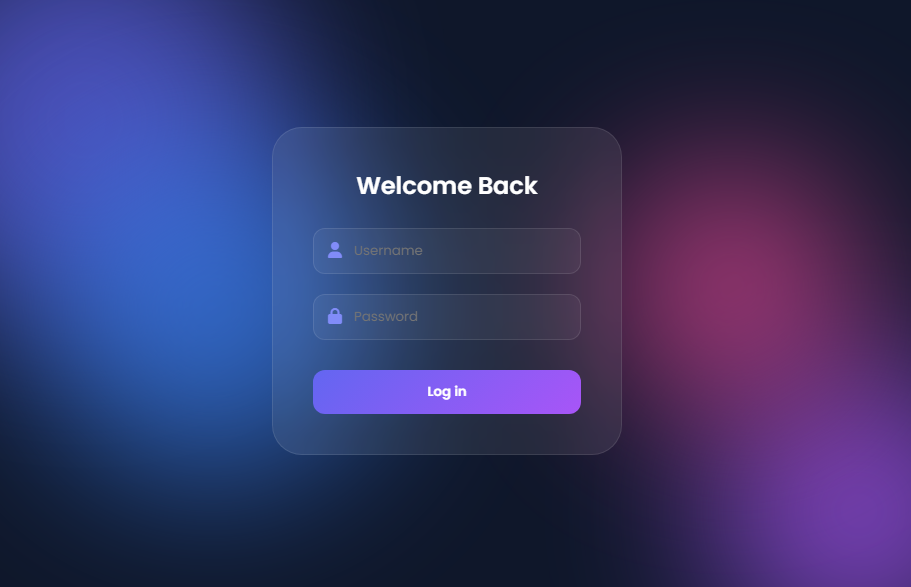

# 🔐 Modern Login Page

**Modern Login Page** is a clean, responsive, and modern authentication interface built with HTML, CSS, and JavaScript. Featuring a glassmorphism-inspired design, smooth animations, and a user-friendly layout, this project provides an elegant login experience across desktop and mobile devices.

Designed with simplicity and modern UI principles, **Modern Login Page** can be used as a starting point for authentication pages in web applications, dashboards, portfolios, and admin panels.

---

# ✨ Features

## 🔑 Modern Login Interface

A clean and professional login form with a modern user experience.

## 🎨 Glassmorphism UI Design

Beautiful glass-style interface with gradient backgrounds and soft visual effects.

## 📱 Responsive Layout

Fully responsive design that adapts perfectly to desktop, tablet, and mobile devices.

## ⚡ Smooth Animations

Modern transitions and hover effects provide a seamless user experience.

## 🛡️ User-Friendly Form

Simple login form including:

- Username Input
- Password Input
- Interactive Login Button

## 🚀 Fast Performance

Optimized HTML, CSS, and JavaScript ensure fast loading and smooth interactions.

---

# 📸 Preview

<div align="center">
  <a href="https://mfs-portfoliouz.netlify.app/portfolio1/projects">
    
  </a>
  <p><i>Click to watch the demo on my portfolio</i></p>
</div>

*Click to view the live demo.*

---

# 🛠️ Built With

| Technology | Purpose |
|------------|----------|
| HTML5 | Structure & Semantic Layout |
| CSS3 | Styling, Responsive Design & Animations |
| JavaScript (ES6+) | Form Interaction & Validation |

---

# 🚀 Getting Started

## Clone the Repository

```bash
git clone https://github.com/muxriddin-web/LoginPage
```

---

## Navigate into the Project

```bash
cd LoginPage
```

---

## Run the Project

Simply open:

```text
index.html
```

in your favorite browser.

No installation or server setup required.

---

# 🔐 Login Components

| Component | Description |
|-----------|-------------|
| Username Field | User name input |
| Password Field | Secure password input |
| Login Button | Submit login credentials |
| Responsive Layout | Works on all screen sizes |

---

# 🎨 UI Features

The interface includes:

- Glassmorphism design
- Gradient background
- Responsive layout
- Soft shadows
- Smooth hover animations
- Modern typography

Future versions will introduce additional authentication features.

---

# 📊 Future Authentication Features

Future updates may include:

- Login Validation
- Remember Me Option
- Show / Hide Password
- Forgot Password
- Email Authentication
- Social Login
- Two-Factor Authentication (2FA)

---

# 📱 Responsive Design

Fully optimized for:

- 💻 Desktop
- 💼 Laptop
- 📱 Mobile
- 📟 Tablet

---

# 🌟 Future Roadmap

- [ ] Form Validation
- [ ] Remember Me
- [ ] Forgot Password
- [ ] Registration Page
- [ ] Dark / Light Mode
- [ ] Password Strength Indicator
- [ ] Email Verification
- [ ] Two-Factor Authentication
- [ ] Backend Integration
- [ ] API Authentication

---

# 📂 Project Structure

```text
modern-login-page/
│
├── index.html
├── style.css
├── script.js
│
├── assets/
│   ├── images/
│   ├── icons/
│   └── fonts/
│
├── README.md
└── LICENSE
```

---

# 🤝 Contributing

Contributions are always welcome!

Fork the repository.

Create your feature branch.

```bash
git checkout -b feature/AmazingFeature
```

Commit your changes.

```bash
git commit -m "Add AmazingFeature"
```

Push to GitHub.

```bash
git push origin feature/AmazingFeature
```

Open a Pull Request.

---

# 📝 License

This project is distributed under the **MIT License**.

See the **LICENSE** file for more information.

---

# 📬 Contact

If you have questions, suggestions, or feedback, feel free to reach out.

### Project Repository

```text
https://github.com/muxriddin-web/LoginPage
```

### Author

**Muxriddin O'tkirov**

### GitHub

```text
https://github.com/muxriddin-web
```

---

# ⭐ Support

If you like this project, don't forget to give it a ⭐ on GitHub!

It helps the project grow and motivates future development.

---

# 💡 Quote

> **"A great user experience begins with a beautiful login page."**

---

## ❤️ Made with HTML, CSS & JavaScript
